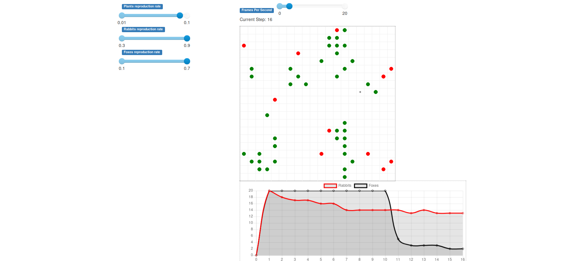

# In "foraging" folder :
# Model
A simple agent-based model on a toroidal grid

To run the model, just clone and run python3 foraging/model_viz.py

# Agents
## Plants 
Plants are fixed, and reproduce asexually by making offshoots. Every turn they grow until they are fully grown and eatable by rabbits

## Rabbits
Every turn, rabbits must :
  - Move one case
  - Eat a carrot

Moving one case is pretty straightforward : they just move randomly
Rabbits must eat a carrot every turn :
  - If a rabbit hasn't been eating carrots for five turns, they die
  - If a rabbit is on the same case as a fully grown plant, they can gain a carrot
  - If a rabbit has more than a fixed number of carrot, they can give the carrot to a rabbit on the same case
  - Rabbit can accumulate carrots and keep the carrots with them
Every turn, rabbits can also reproduce :
  - If they are on the same case as another rabbit of the opposite sex, they can create a new rabbit with a fixed probability
  
## Foxes
Every turn Foxes must : 
  - Move
  - Eat a rabbit

They are mostly similars to rabbit with a few differences : 
  - They are less likely to reproduce in any given encounter with an opposite sex fox
  - They can't accumulate rabbits the way rabbits accumulate carrots
  - Nevertheless, they can spend more turn without eating, and starve much less frequently

The interface should look like that : 

### To do list
    
   - [x] Move rabbits feeding to new method
   - [x] Add carrot ressources on the map
   - [x] Datacollector at agent level
   - [x] Make rabbits find plants
   - [x] Add reproduction
       - [x] Sexual for rabbits
       - [x] shoots for plants
   - [x] move cellmates in step function
   - [x] Add foxes
   - [ ] add cuttings
   - [x] add plants dispersion
   - [ ] add stop condition if species get extinct
   - [x] add vizualisations
   - [ ] Comment
   - [x] Readme
   - [ ] Remove useless libs
   - [ ] Removes prints, add logger -> check first if agents moved to different files
